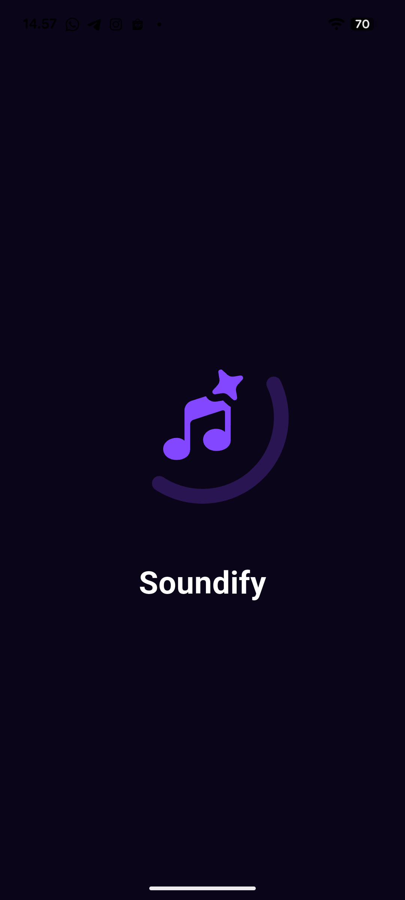

# Soundify - Mobile Programming 2 | UTS | Group 10

**Soundify** is a simple music player application that displays song lists, music recommendations, and modern navigation. This application was developed to fulfill the UTS requirements for Mobile Programming 2, with focus on UI design, page navigation, and utilization of local assets including images and animations.

## 🚀 Tech Stack
- **Flutter** - UI Framework
- **Dart** - Programming Language
- **Lottie** - Animations
- **Slider Page Animation** - Smooth transitions
- **Google Fonts** - Typography
- **Custom Widgets** - Recent Item, Recommended Card, Bottom Navbar, etc.

## ✨ Main Features
- ✅ Local music library with images and asset files
- ✅ Modern UI cards for recommended and recent songs
- ✅ Custom Bottom Navigation Bar
- ✅ Detailed song pages
- ✅ Clean and modular folder structure
- ✅ Lightweight and responsive performance

## 🔧 Installation & Running
1. Clone this repository
2. Create a new Flutter project
3. Import Assets, lib, and pubspec.yaml to your Flutter project
4. Connect an Android Emulator or physical device
5. Run `flutter run`

## 📲 Download App

### Android APK
[-brightgreen)](https://github.com/Wrdn28/uts_soundify_mobo2/releases/download/Soundify/Soundify-release.apk)

### 🔍 APK Information
- **Universal APK**: Compatible with all Android devices (larger file size)
- **64-bit APK**: Optimized for modern devices (smaller file size)
- **32-bit APK**: Support for older Android devices

## 👥 Team Members - Group 10

| Name | Student ID |
|------|------------|
| **Wendi Wardani Mulyadi** | 232101038 |
| **Ariel Ahmadi Lesmana** | 232101009 | 
| **M Raihan Fadhilah** | 232101040 |

## 📱 Screenshots

---
**© 2025 Group 10 - Mobile Programming 2**
